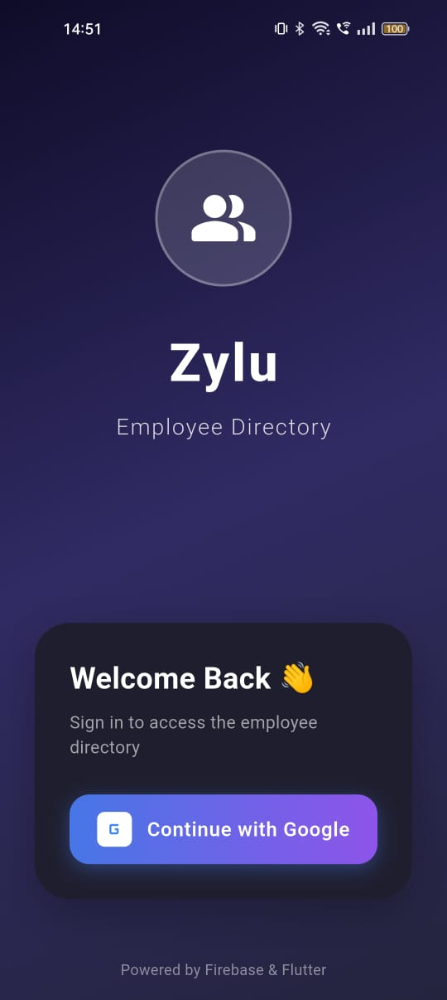
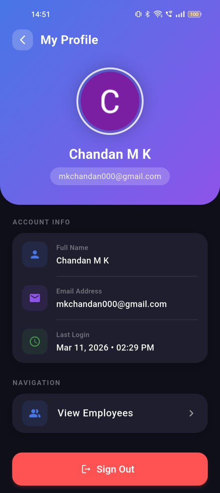
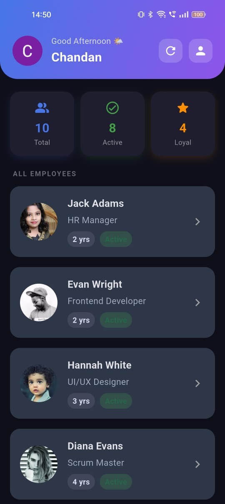
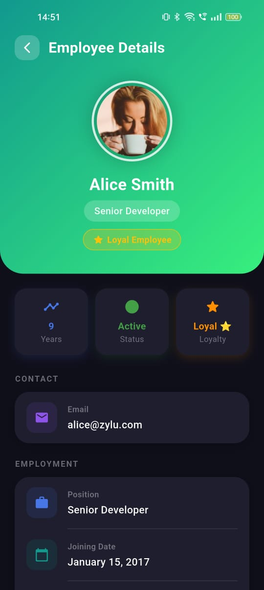

# Zylu Employee Directory

A **production-quality Flutter application** demonstrating Clean Architecture, BLoC Pattern, Firebase Firestore, and Google Sign-In. Built to demonstrate 5+ year Flutter developer quality.

---

## 📱 Screenshots

<div align="center">

<table>
  <tr>
    <td align="center">
      
      <br/><b>Login Screen</b>
    </td>
    <td align="center">
      
      <br/><b>Employee Dashboard</b>
    </td>
    <td align="center">
      
      <br/><b>Employee Details</b>
    </td>
    <td align="center">
      
      <br/><b>Profile Screen</b>
    </td>
  </tr>
</table>

</div>

---

## 🏗️ Architecture Overview

This project strictly follows **Clean Architecture** with unidirectional dependency flow:

```
Presentation  →  Domain  ←  Data
    (UI/BLoC)    (Business)  (Firebase)
```

### Layer Breakdown

| Layer        | Responsibility                                   |
|--------------|--------------------------------------------------|
| **Domain**   | Entities, UseCases, Repository interfaces (pure Dart) |
| **Data**     | Models (json_serializable), Datasources, Repository Implementations |
| **Presentation** | BLoC events/states, Pages, Widgets          |

---

## 🗂️ Project Structure

```
lib/
├── core/
│   ├── errors/       # Failure classes
│   └── theme/        # Light & Dark Material 3 themes
├── di/
│   └── injector.dart # GetIt dependency injection
├── features/
│   ├── auth/
│   │   ├── domain/   # User entity, AuthRepository, UseCases
│   │   ├── data/     # UserModel, FirebaseAuthDatasource, AuthRepositoryImpl
│   │   └── presentation/ # AuthBloc + LoginScreen + ProfileScreen
│   └── employees/
│       ├── domain/   # Employee entity, EmployeeRepository, UseCases
│       ├── data/     # EmployeeModel, FirebaseEmployeeDatasource, EmployeeRepositoryImpl
│       └── presentation/ # EmployeeBloc + List/Detail screens
└── main.dart
```

---

## ✨ Features

- 🔐 **Google Sign-In** (Firebase Auth)
- 🔄 **Persistent Session** — already logged-in users skip directly to dashboard
- 👥 **Employee Directory** fetched from Firestore
- 🌟 **Loyal Employee Flagging** — green highlight for employees with ≥5 years AND active status
- 👤 **Profile Screen** — shows Google account info + logout
- 🚪 **Logout Confirmation** — confirmation dialog before signing out
- 🌙 **Light & Dark Mode** with Material 3
- ⚡ **Shimmer loading** skeletons
- 🔄 **Pull-to-refresh**
- 🎭 **Hero animations** on profile images
- 📊 **Stats Dashboard** — Total / Active / Loyal counts

---

## 🛠️ Tech Stack

| Concern              | Technology                        |
|----------------------|-----------------------------------|
| State Management     | `flutter_bloc`                    |
| Dependency Injection | `get_it`                          |
| Routing              | `go_router`                       |
| Serialization        | `json_serializable`               |
| Auth                 | Firebase Auth + Google Sign-In v7 |
| Database             | Firebase Firestore                |
| UI                   | Material 3                        |

---

## 🚀 Setup Guide

### 1. Install Dependencies

```sh
flutter pub get
```

### 2. Firebase Setup

1. Go to [Firebase Console](https://console.firebase.google.com/) and create a project named `zylu-employee-directory`
2. Enable **Authentication** → **Google Sign-In**
3. Enable **Firestore Database**
4. Create two collections:
   - `employees` (see schema below)
   - `users`

### 3. FlutterFire Configure

Install the FlutterFire CLI and configure your project:

```sh
dart pub global activate flutterfire_cli
flutterfire configure
```

This generates `lib/firebase_options.dart`. Then update `main.dart`:

```dart
import 'firebase_options.dart';

// In main():
await Firebase.initializeApp(options: DefaultFirebaseOptions.currentPlatform);
```

### 4. Register SHA-1 Fingerprint (Android)

Google Sign-In on Android requires your debug SHA-1 to be registered in Firebase:

```sh
keytool -list -v -keystore ~/.android/debug.keystore -alias androiddebugkey -storepass android -keypass android
```

Add the `SHA1` value in Firebase Console → Project Settings → Your Android App → Add Fingerprint.

### 5. Run Code Generators

```sh
dart run build_runner build --delete-conflicting-outputs
```

### 6. Seed Firestore with Sample Data

Temporarily add to `main()`:
```dart
import 'seeder.dart';
await seedDatabase(); // run once, then remove
```

### 7. Run the App

```sh
flutter run
```

---

## 🗄️ Firestore Schema

### `employees` collection

| Field         | Type      | Example                    |
|---------------|-----------|----------------------------|
| `id`          | String    | `"abc123"`                 |
| `name`        | String    | `"Alice Smith"`            |
| `email`       | String    | `"alice@zylu.com"`         |
| `position`    | String    | `"Senior Developer"`       |
| `joiningDate` | Timestamp | `2017-01-15`               |
| `isActive`    | Boolean   | `true`                     |
| `profileImage`| String?   | `"https://..."` (optional) |

### `users` collection

| Field       | Type      | Notes                      |
|-------------|-----------|----------------------------|
| `id`        | String    | Firebase Auth UID          |
| `name`      | String    | Display name               |
| `email`     | String    | Google email               |
| `photoUrl`  | String?   | Profile photo URL          |
| `lastLogin` | Timestamp | Updated on each login      |

---

## 🏆 Business Rule: Loyal Employee

```dart
// In Employee entity:
bool get isLoyalEmployee => yearsInCompany >= 5 && isActive;
```

When `isLoyalEmployee == true`, the employee card shows:
- 🟢 Green border around the card
- ⭐ Star icon and "Loyal" badge
- Subtle green background tint

---

## 📱 Screens

| Screen | Description |
|---|---|
| **Login** | Gradient UI with animated Google Sign-In button |
| **Dashboard** | Gradient header with user avatar, greeting, stats row, employee list |
| **Employee Detail** | Full profile — green gradient for loyal employees |
| **Profile** | Google account info, last login, sign-out with confirmation |

---

## 📋 Commands Reference

```sh
# Get dependencies
flutter pub get

# Run code generator
dart run build_runner build -d

# Configure Firebase
flutterfire configure

# Run app
flutter run

# Analyze code
dart analyze
```
